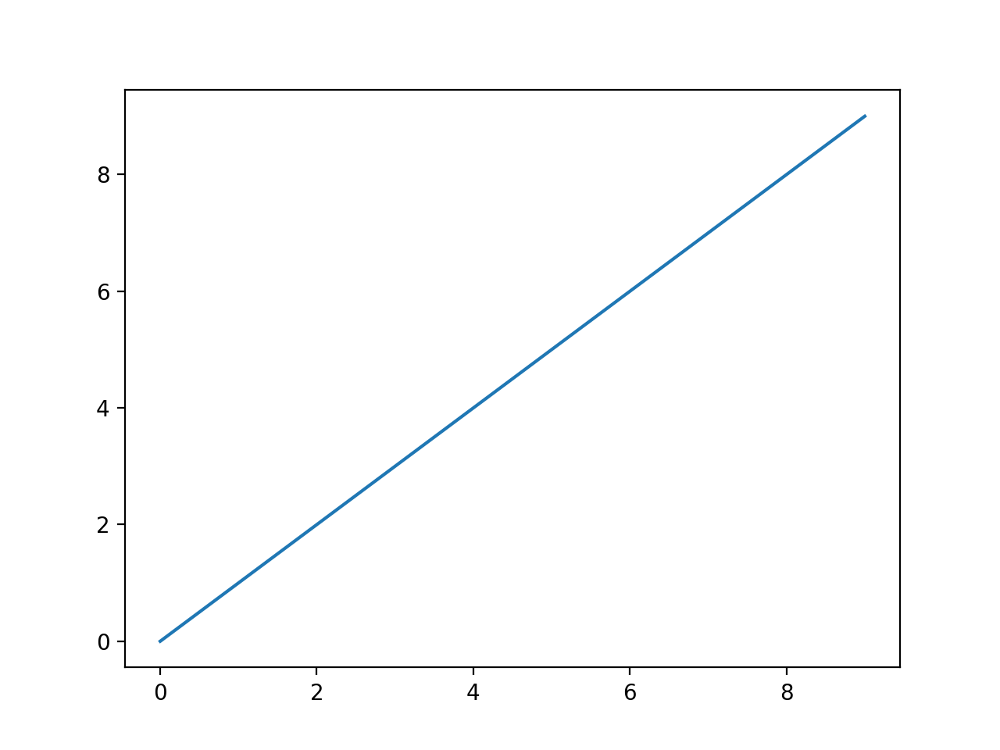
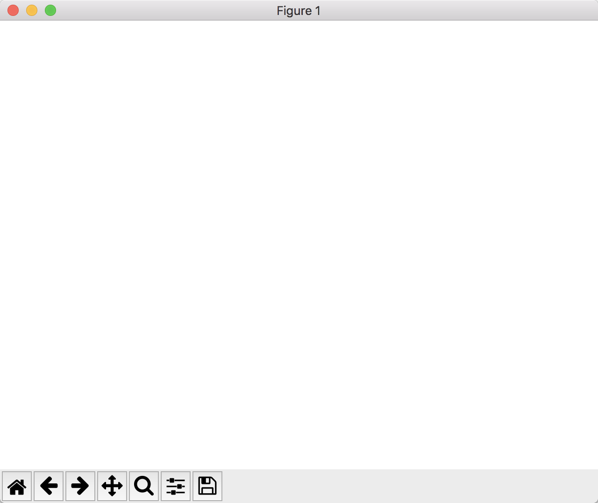
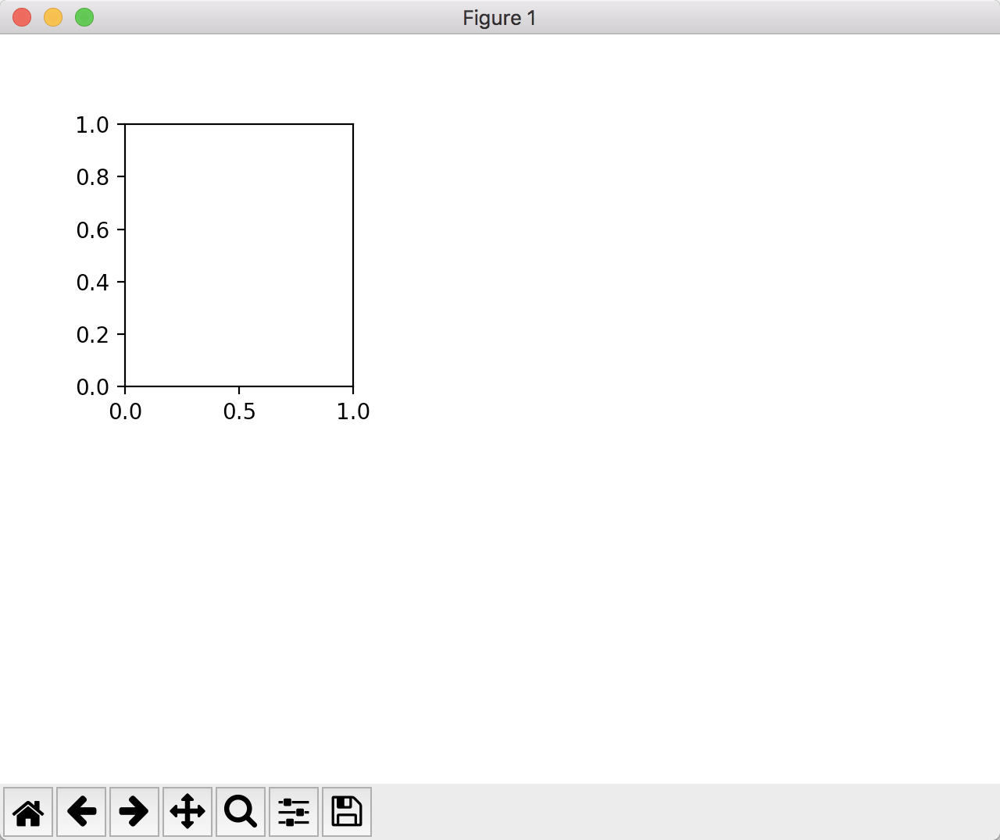
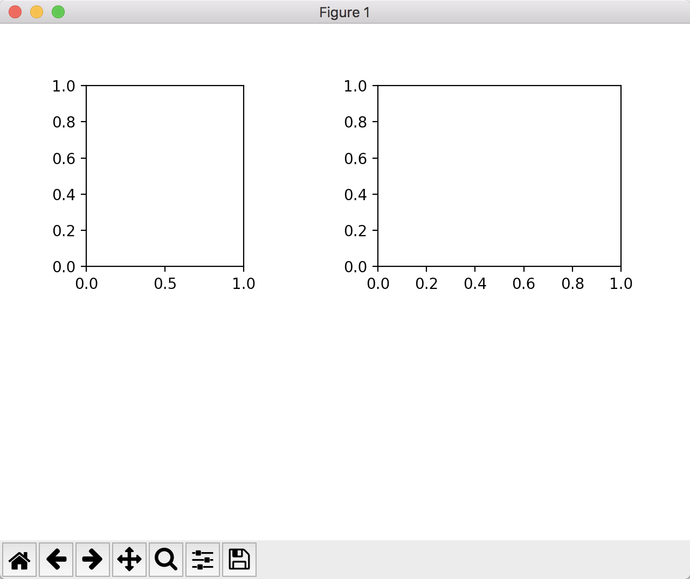
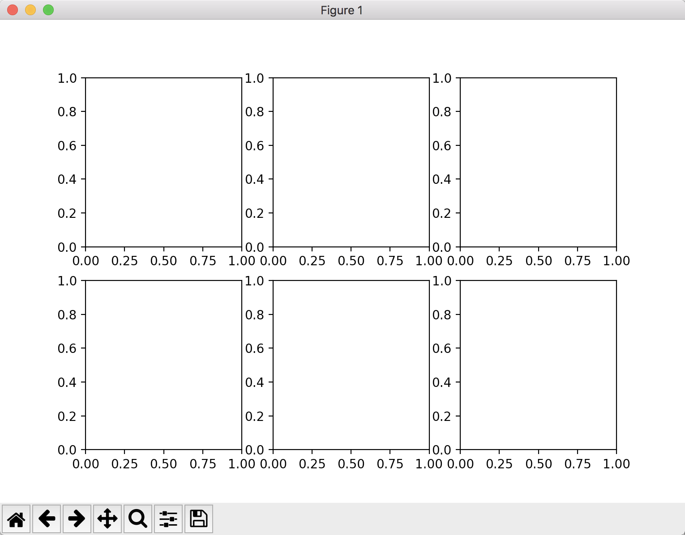

# Matplotlib库

​	python中的matplotlib库可以在python中像matlab一样使用。

​	在Ipython中输入：

```python
%matplotlib
```

​	或在Jupyter notebook中输入：

```python
%matplotlib notebook
```


## matplotlib.pyplot

​	首先导入matplotlib的pyplot库，这个库可以使数据可视化。

```python
import matplotlib.pyplot as plt
```

​	对一个narray对象绘图：

```python
import numpy as np
data=np.arange(10)
plt.plot(data)
```

​	就能绘出一条直线。




### figure和subplots

​	把一个figure()实例化给一个变量，就会出现



####add_subplot()

​	使用add_subplot()方法可以设定这个图里能画几个子图，如

```python
ax1=fig.add_subplot(2,3,1)
```

​	表示在高1/2处，宽1/3第一个位置生成一个图


​	若再输入

```python
ax2=fig.add_subplot(2,2,2)
```

​	则会出现



​	即在2x2区域内第二个生成一个子图。

#### subplots()

​	当然，使用subplots()可以直接生成全部子图，如

```python
fig,axes=plt.subplots(2,3)
```



​	即生成2行3列的2x3=6个子图。

​	哪个子图绘制什么图形像取narray一样用axes[i,j]就行。**默认会在最后一个字图里画。**

### 设定线的颜色，标记和线性

​	例如设置颜色为绿色，点的地方标记为圆点，线性为虚线：

```python
ax1.plot(data,linestyle='--',color='g',marker='o')
```


​	也可以用简写：

```python
ax1.plot(data,'go--')
```

​	这样就方便多了。

