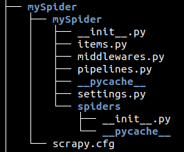
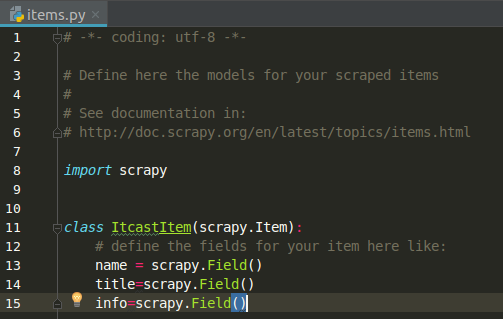
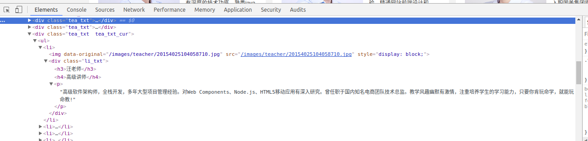

# Python 爬虫

​	统一资源定位符：URL格式(由6个部分组成)

​	*pro_sch://net_loc/path;params?query#frag*

|   URL组件    |          描述           |
| :--------: | :-------------------: |
| *prot_sch* |   网络协议或下载方案（如http）    |
| *net_loc*  |   服务器所在地（也许含有用户信息）    |
|   *path*   | 使用斜杠(/)分割的文件或CFI应用的路径 |
|  *params*  |         可选参数          |
|  *query*   |    连接符(&)分割的一系列键值对    |
|   *frag*   |      指定文档内特定锚的部分      |

​	*net_loc*可以进一步拆分成多个组件，一些是必备的，另一些是可选的：

​						*user : passwd @ host : port*

​	Python支持两种不同的url模块，两者分别以不同功能和兼容性来处理URL。一种是**urlparse**，另一种是**urllib**。

## 1-1. urlparse模块

​	urlparese中的核心函数：

|                urlparse函数                | 描述                                       |
| :--------------------------------------: | :--------------------------------------- |
| urlparse(urlstr,defProtSch=None,allowFrag=None) | 将urlstr解析成各个组件，如果在urlstr中没有给定协议或者方案，则使用defProtSch,allowFrag决定是否允许有URL片段 |
|           urlunuparse(urltup)            | 将URL数据(urltup)的一个元组拼成一个URL字符段            |
|  urljoin(baseurl,newurl,allowFrag=None)  | 将URL的根域名和n                               |

### urlparse():

​	urlparse()将URL字符串解析为一个6元组(prot_sch,net_loc,path,params,query,frag),如：

```python
>>>urlparse.urlparse('http://www.python.org/doc/FAQ.html')
 ('http','www.python.org','/doc/FAQ.html','','','')
```

### urlunparse():

​	urlparse()的逆过程，将6元组拼接成完整的URL字符串。

### urljoin():

​	在需要处理多个相关的URL时需要用到urljoin()，它的语法结构：

​			urljoin(*baseurl,newurl,allowFrag=None*)	

​	urljoin()取得根域名，并将起根路径(net_loc及其前面的完整路径，但是不包括末端的文件)与*newurl*连接起来。如：

```python
>>>urlparse.urljoin('http://www.python.org/doc/FAQ.html','current/lib/lib.html')
 'http://www.python.org/doc/current/lib/lib.html'
```

​	**在python3中，urlparse已经并入了urllib的模块中，在urllib中的parse中,所以调用以上函数需要写成 urllib.parse.urljoin（）。**

## 1-2.urllib模块

​	urllib模块中的核心函数：

|                 urllib函数                 | 描述                                       |
| :--------------------------------------: | :--------------------------------------- |
|   urlopen(*urlstr,postQueryData*=None)   | 打开URL *urlstr*，如果是POST请求，则通过*postQueryData*发送请求 |
| urlretrieve(**urlstr,localfile*=None,*downloadStatusHook*=None) | 将URL *urlstr*中的文件下载到*localfile*或临时文件中(如果没有指定*localfile*);如果函数正在执行，*downloadStatusHook*将会获得下载的统计信息 |
|        quote(*urldata,safe*='/')         | 对*urldata*在URL里无法使用的字符进行编码,*safe*中的字符无需编码 |
|      quete_plus(*urldata,safe*='/')      | 除了将空格编译成(+)号(而非%20)之外，其他功能与quote()相似     |
|            unquote(*urldata*)            | 将*urldata*中编码过的字符解码                      |
|         unquote_plus(*urldata*)          | 除了将加号转换成空格，其他功能与unqueto()相同              |
|            urlencode(*dict*)             | 将dict的键值对通过quote_plus()编译成有效的CGI查询字符串，用quote_plus()对这个字符串进行编码 |

### urlopen()

​	urlopen()打开一个给定的URL字符串表示的Web链接，并返回文件类型的对象。

​	**如果没有给定协议或者下载方案，或者传入“file”方案，urlopen()会打开一个本地文件。**

​	一旦连接成功，urlopen()返回文件类型对象，那么就可以用处理文件的方法如 **f.read()、f.readline()、f.readlines()、f.close()、f.fileno()**来调取它。

|  urlopen()对象方法  | 描述                |
| :-------------: | :---------------- |
| f.read([bytes]) | 从f中读取出所有或bytes个字符 |
|  f.readline()   | 从f中读取一行           |
|  f.readlines()  | 从f中读取所有行，作为列表返回   |
|    f.close()    | 关闭f的URL连接         |
|   f.fileno()    | 返回f的文件句柄          |
|    f.info()     | 获得f的MIME头文件       |
|   f.genturl()   | 返回f的真正URL         |

​	**在python3中这个模块已经合并到了urllib.request中，即调用时要使用 urllib.request.urlopen() 函数**

### urlretrieve()

​	urlretrieve可以将urlstr中的整个HTML文件下载下来。urlretrieve()返回一个二元组（*filename,mine_hdrs*),*filename*是含有下载数据的本地文件名，*mime_hdrs*是Web服务器响应后返回的一系列MIME文件头。对于本地文件来说*mime_hdrs*是空的。

###quote()、quote_plus()、unquote()、unquote_plus()、urlencode()

​	quote()、quote_plus()、unquote()、unquote_plus()、urlencode()这些都是用于编码的解码。


## 1-3.requests模块

​	requests模块是基于urllib模块而比urllib更方便的模块

各种请求方法:

```python
requests.get(‘https://github.com/timeline.json’) #GET请求
requests.post(“http://httpbin.org/post”) #POST请求
requests.put(“http://httpbin.org/put”) #PUT请求
requests.delete(“http://httpbin.org/delete”) #DELETE请求
requests.head(“http://httpbin.org/get”) #HEAD请求
requests.options(“http://httpbin.org/get”) #OPTIONS请求
```

定制header:

```python
import requests
 
data = {'some': 'data'}
headers = {'content-type': 'application/json',
           'User-Agent': 'Mozilla/5.0 (X11; Ubuntu; Linux x86_64; rv:22.0) Gecko/20100101 Firefox/22.0'}
 
r = requests.post('https://api.github.com/some/endpoint', data=data, headers=headers)
print(r.text)
```

响应:

```python
r.status_code #响应状态码
r.raw #返回原始响应体，也就是 urllib 的 response 对象，使用 r.raw.read() 读取
r.content #字节方式的响应体，会自动为你解码 gzip 和 deflate 压缩
r.text #字符串方式的响应体，会自动根据响应头部的字符编码进行解码
r.headers #以字典对象存储服务器响应头，但是这个字典比较特殊，字典键不区分大小写，若键不存在则返回None
#*特殊方法*#
r.json() #Requests中内置的JSON解码器
r.raise_for_status() #失败请求(非200响应)抛出异常
```


以下转自[官方文档](http://blog.csdn.net/sofeien/article/details/50819452)

```python
import requests  
import json  
  
#发送POST请求  
#r = requests.post("http://httpbin.org/post")  
  
#发送其他类型请求  
#r = requests.put("http://httpbin.org/put")  
#r = requests.delete("http://httpbin.org/delete")  
#r = requests.head("http://httpbin.org/get")  
#r = requests.options("http://httpbin.org/get")  
  
#传递参数的GET请求  
#payload = {'key1': 'value1', 'key2': 'value2'}  
#r = requests.get("http://httpbin.org/get", params=payload)  
#print(r.url)  
  
#查看相应内容，会自动解码  
#print(r.text)  
  
#查看，指定URL编码  
#print(r.encoding)  
#r.encoding = 'ISO-8859-1'  
  
#以字节方式访问相应,会自动解码gzip和deflate压缩的数据  
#print(r.content)  
  
#创建图片  
#from PIL import Image  
#from io import StringIO  
#i= Image.open(StringIO.StringIO(r.content))  
  
#处理JSON数据  
#import requests  
#r=requests.get('https://github.com/timeline.json')  
#print(r.json())  
  
#返回原始相应内容  
##>>> r = requests.get('https://github.com/timeline.json', stream=True)  
##>>> r.raw  
##<requests.packages.urllib3.response.HTTPResponse object at 0x101194810>  
##>>> r.raw.read(10)  
##'\x1f\x8b\x08\x00\x00\x00\x00\x00\x00\x03'  
  
#保存文本,针对返回原始内容byte  
##with open(filename, 'wb') as fd:  
##    for chunk in r.iter_content(chunk_size):  
##        fd.write(chunk)  
  
#添加头部  
##>>> import json  
##>>> url = 'https://api.github.com/some/endpoint'  
##>>> payload = {'some': 'data'}  
##>>> headers = {'content-type': 'application/json'}  
##  
##>>> r = requests.post(url, data=json.dumps(payload), headers=headers)  
  
#账号密码登陆  
#r = requests.get('https://api.github.com/user', auth=('user', 'pass'))  
  
#发送表单数据  
##paylaod={"key1":"value1","key2":"value2"}  
##r=requests.post("http://httpbin.org/post",data=paylaod)  
##print(r.text)  
  
#发送string数据  
##import json  
##payload={"key1":"value1","key2":"value2"}  
##r=requests.post("http://httpbin.org/post",data=json.dumps(payload))  
##print(r.text)  
  
#发送文件  
##url='http://httpbin.org/post'  
##files={'file':open('report.xls','rb')}  
#显式设置文件名，文件类型，请求头：  
##files={'file': ('report.xls', open('report.xls', 'rb'), 'application/vnd.ms-excel', {'Expires': '0'})}  
#发送文件形式的字符串  
##files={'file': ('report.csv', 'some,data,to,send\nanother,row,to,send\n')}  
##r=requests.post(url,files=files)  
##print(r.text)  
  
#检测响应码  
##r=requests.get('http://httpbin.org/get')  
##print(r.status_code)  
##print(r.status_code==requests.codes.ok)  
##bad_r = requests.get('http://httpbin.org/status/404')  
##print(bad_r.status_code)  
##bad_r.raise_for_status()  
  
#响应头  
##r=requests.get('http://httpbin.org/get')  
##print(r.headers)  
##print(r.headers['date'])  
  
#cookies  
##url='http://example.com/some/cookie/setting/url'  
##r=requests.get(url)  
##print(r.cookies['example_cookie_name'])  #报错  
  
#发送cookies  
##url = 'http://httpbin.org/cookies'  
##cookies = dict(cookies_are='working')  
##r = requests.get(url, cookies=cookies)  
##print(r.text)  
  
#重定向  
##r=requests.get('http://github.com')  
##print(r.url)  
##print(r.history)  
  
#超时处理  
##requests.get('http://github.com',timeout=1)  
  
#跨请求保存cookies  
##s = requests.Session()  
##s.get('http://httpbin.org/cookies/set/sessioncookie/123456789')  
##r = s.get("http://httpbin.org/cookies")  
##print(r.text)  
  
#请求保存缺省数据  
##s = requests.Session()  
##s.auth = ('user', 'pass')  
##s.headers.update({'x-test': 'true'})  
### both 'x-test' and 'x-test2' are sent  
##r=s.get('http://httpbin.org/headers', headers={'x-test2': 'true'})  
##print(r.text)  
  
#简单获取请求头部和返回头部  
##url='http://www.baidu.com/'  
##r=requests.get(url)  
#返回头部  
##print(r.headers)  
#请求头部  
##print(r.request.headers)  
  
#设置SSL证书  
#requests.get('https://kennethreitz.com', cert=('/path/server.crt', '/path/key'))  
```


## 1-4.Scrapy框架

​	Scarpy是纯python实现一个为了爬取网站数据、提取结构性数据而编写的应用框架，用途非常广泛。用户只需要定制开发几个模块就能轻松的实现一个爬虫，用来捉取网页内容以及各种图片，非常方便。

​	Scrapy使用了Twisted(其主要对手是Tornado)异步网络框架来处理通络通讯，可以加快下载速度，不用自己去实现异步框架，并包含了各种中间件的接口，可以灵活的完成各种需求。


- Scrapy Engine(引擎) : 负责 Spider、ItemPiplilne、Downloader、Scheduler中间的通讯，信号、数据传递等。
- Scheduler(调度器) : 负责接受引擎发送过来的Requests请求，并按照一定的方式进行整理排列，入队，当引擎需要时，交还给引擎。
- Downloader(下载器) : 负责下载Scrapy Engine发送的所有Requests请求，并将其获取到的Responses交还给Scrapy Engine，由引擎交给Spider处理。
- Spider (爬虫) : 负责处理所有的Responses，从中分析提取数据，获取Item字段需要的数据，并将需要跟进的URL提交给引擎，再次进入Scheduler。
- Item Pipeline(管道) : 负责处理Spider中获取到的Item，并将其进行后期处理(详细分析、过滤、存储等)的地方。
- Downloader Middlewares(下载中间件) : 可以当做是一个可以自定义扩展下载功能的组件
- Spider Middlewares(Spider中间件) : 可以理解为是一个可以自定义扩展和操作引擎和Spider中间通信的功能组件(比如进入Spider的Responses和从Spider出去的Requests)。

### 制作Scrapy爬虫一共需要4步

- 新建项目(scrapy startproject xxx)：新建一个爬虫项目

- 明确目标(编写items.py)：明确你想要爬取的目标

- 制作爬虫(spiders/xxspider.py)：制作爬虫开始爬取网页

- 存储内容(pipelines.py)：设计管道存储爬取的内容


### scrapy简单案例

#### 一.创建项目

```shell
scrapy startproject mySpider
```

这样就会生成一个文件夹，里面包含:



各个文件的作用:

- mySpider/  : 项目的Python模块，将会从这里引用代码
- mySpider/items.py : 项目的目标文件
- mySpider/pipelines.py : 项目的管道文件
- mySpider/settings.py : 项目的设置文件
- mySpider/spiders/ : 存储爬虫代码目录
- scrapy.cfg : 项目的配置文件


####二.明确目标 (mySpider/items.py)

目标：爬取 http://www.itcast.cn/channel/teacher.shtml 里所有讲师的姓名、职称和个人信息。

1. 打开mySpider目录下的item.py 

2. Item定义结构化数据字段，用来保存爬取的数据，有点像Python中的dict，但是提供了一些额外的保护减少错误

3. 可以通过创建一个scrapy.Item类，并且定义类型为Scrapy.Field的类属性来定义一个item

4. 接下来，创建一个ItcastItem类，和构建item模型


#### 三.制作爬虫 (spiders/itcast.py)

爬虫分为两步：

**1.爬数据**

在当前目录下输入以下命令，将在mySpider/spider目录下创建一个名为itcast的爬虫，并指定爬取域的范围

```shell
scrapy genspider itcast "itcast.cn"
```

打开mySpider/spider目录里的itcast.py，默认增加了下列代码：

```python
# -*- coding: utf-8 -*-
import scrapy


class ItcastSpider(scrapy.Spider):
    name = 'itcast'
    allowed_domains = ['itcast.cn']
    start_urls = ['http://itcast.cn/']

    def parse(self, response):
        pass

```

**其实也可以自己去创建itcast.py并编写上面的代码，不过使用命令可以免去编写固定代码的麻烦。**

要建立一个Spider，必须用scrapy.Spider类创建一个子类，并确定**三个强制的属性**和**一个方法**。

- name=" " : 这个爬虫的识别名称，必须是唯一的，在不同的爬虫必须定义不同的名字。

- allow_doains=[ ] : 是搜索的域名范围，也就是爬虫的约束范围，规定爬虫只爬取这个域名下的网页，不存在的URL会被忽略

- start_urls=[ ] : 爬取的URL列表。爬从这里开始爬取数据，所以，第一次下载的数据将会从这些url开始。其他子url将会从这些起始url中继承性生成。

- parse(self,response) : 解析的方法，每个初始url完成下载后将会被调用，调用的时候传入从每一个URL传回的Response对象来作为唯一参数，主要作用如下：

  ​	1.负责解析返回的网页数据(response.body)，提取结构化数据(生成item)

  ​	2.生成需要下一页的url请求

  **将start_urls的值修改为需要爬取的第一个url**

```python
start_urls = ['http://www.itcast.cn/channel/teacher.sheml']
```

**修改parse()方法**

```python
def parse(self, response):
    with open("teacher.html","w") as f:
        f.write(response.text)
```

然后运行以下看看，在mySpider目录下执行:

```shell
scrapy crawl itcast
```

运行之后，如果打印的日志出现  [scrapy.core.engine] INFO: Spider closed (finished)  ，代表执行完成。之后当前文件夹中就会出现一个teacher.html文件，里面就是刚刚爬取的网页的全部源代码信息。


**2.取数据**

爬取整个网页完毕，接下来就是去过程了，首先观察页面源码：

即在

```html
<div class="li_txt">
  <h3> xxx </h3>
  <h4> xxxx </h4>
  <p> xxxxxxx </p>
```

中

然后用XPath开始提取数据：

```python
# -*- coding: utf-8 -*-
import scrapy
from mySpider.items import ItcastItem

class ItcastSpider(scrapy.Spider):
    name = 'itcast'
    allowed_domains = ['itcast.cn']
    start_urls = ['http://www.itcast.cn/channel/teacher.shtml']

    def parse(self, response):
#        with open("teacher.html","w") as f:
 #           f.write(response.text)

#        items=[]

        for each in response.xpath("//div[@class='li_txt']"):
            item=ItcastItem()

            name=each.xpath("./h3/text()").extract()
            title=each.xpath("./h4/text()").extract()
            info=each.xpath("./p/text()").extract()

            item['name']=name[0]
            item['title']=title[0]
            item['info']=info[0]

#            items.append(item)

            yield item
#       return items
```

这里用yield比用return好。这样item就会传给管道了。

保存数据命令：

​	scrapy保存信息的最简单的方法主要有四种，-o输出指定格式的文件，命令如下：

```shell
#json格式，默认为Unicode编码
scrapy crawl itcast -o xxx.json

#json lines格式，默认为Unicode编码
scrapy crwal itcast -o xxx.jsonl

#csv 逗号表达式，可用Excel打开
scrapy crwal itcast -o xxx.csv

#xml 格式
scrapy crwal itcast -o xxx.xml
```

除此之外，也可以设置管道来保存数据。


#### 四.设计管道(spiders/pipelines.py)

首先在pipelines.py中写入存储位置：

```python
import json

class ItcastPipeline(object):
    def __init__(self):
        self.f=open("itcast_piprline.json","w")

    def process_item(self, item, spider):
        content=json.dumps(dict(item),ensure_ascii=False)+",\n"
        self.f.write(content)
        return item

    def close_spider(self,spider):
        self.f.close()

```

然后在settings.py中把这个管道启用：

```python
ITEM_PIPELINES = {
    'mySpider.pipelines.ItcastPipeline': 300,
}
```

最后在需要存储的目录下运行：

```shell
scrapy crawl itcast
```


pipelines.py文件的一些方法：

```python
class xxxxPipeline(object):
    def __init(self):
        #可选实现，做参数初始化等
        
    def process_item(self,item,spider):
        #item(Item对象)--被爬取的item，也就是在爬虫文件中parse()函数返回的结果
        #spider(Spider对象)--爬取该item的sipder，当多个爬虫的时候可以用这个来区分
        #这个方法必须实现，每个item pipeliene组件都需要调用该方法
        #这个方法必须返回一个Item对象，被丢弃的item将不会被之后的pipeline组件处理。
        return item
    
    def open_spider(self,spider):
        #spider(Spder对象)--被开启的spider
        #可选实现，当spider被开启时，这个方法被调用
        
    def close_spider(self,spider):
        #可选实现,当spider被关闭时，这个方法被调用
```


### Scrapy Shell

​	Scrapy终端是一个交互终端，可以在未启动spider的情况下尝试及调试代码，也可以用来测试XPath或CSS表达式，查看他们的工作方式，方便我们爬取网页中提取的数据。

​	如果安装了Ipython，Scrapy终端将使用Ipython(替代标准Python终端)。

**启动Scrapy Shell**

​	进入项目的根目录，执行下列命令来启动shell ：

```shell
scrapy shell "http:www.xxxxx.xxx"
```

​	Scrapy Shell根据下载的页面会自动创建一些方便使用的对象，例如Response对象，以及Selector对象(对HTML及XML内容)。

- 当shell载入后，将得到一个包含response数据的本地response变量，输入response.body将输出response的包体，输入response.headers可以看到response的包头
- 输入response.selector时，将获取的一个response初始化的类Selector的对象，此时可以通过使用response.selector.xpath()或response.selector.css()来对response进行查询
- Scrapy也提供了一些快捷方式，例如response.xpath()或response.css()同样可以生效。

[官方文档](https://doc.scrapy.org/en/latest/index.html)

[中文文档](http://scrapy-chs.readthedocs.io/zh_CN/0.24/)（目前只有0.24版本）